# 1.1.3 机器学习是人工智能的基石

## 第一部分

正如我们之前所说，理性的智能体不仅应该感知它的环境，还要学习它。但是，计算机从其环境中学习是什么意思？

例如，简单地将存储数据来学习吗？这个问题的答案是否定的。存储数据的计算机称为数据库，它与学习无关。相反，学习意味着泛化的能力。

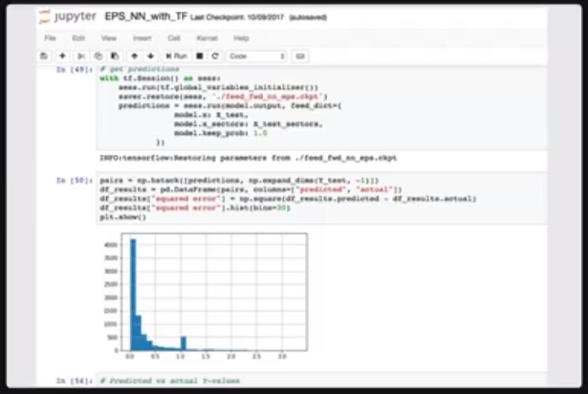

为了在呈现新数据时采取最优行动，将显示的数据用于学习就足够了。泛化是学习的最终目标，或者我们甚至可以说，学习是一种方法，在没见过的数据上很好地完成任务。

机器学习分别是人工智能的一个子领域，它研究感知，学习和行为任务，作为从原始数据中学习的算法。

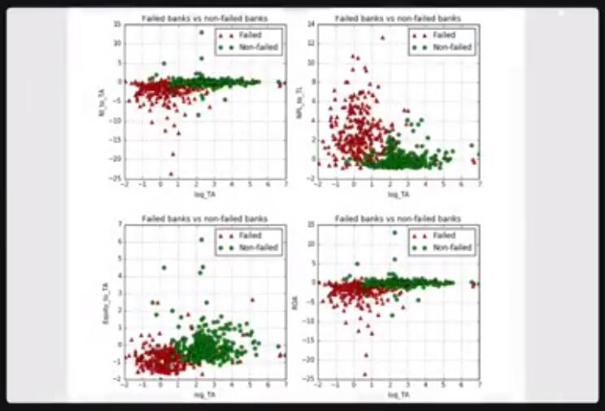

机器学习已经出现，或者我们甚至可以说它在统计建模和动态规划等领域中脱颖而出，作为对现实世界工业需求的响应，需要有效处理大型和高维数据的方法。机器学习通过关注计算机算法，来估计复杂函数，它们通常不能以封闭形式表达，来使这些领域现代化。此外，机器学习还受益于许多领域，如信息论，计算机科学，物理学，神经科学，生物学等。作为一般人工智能研究的一个特定子领域，机器学习用于人工智能领域，如测量语言处理，基于知识的系统和任务，或者在广义人工智能领域。我还想提醒你，我提到的机器智能一词。作为一个建议的课程，我们应该假设它们代表人工创业公司以及大公司所追求的 AI 空间项目。

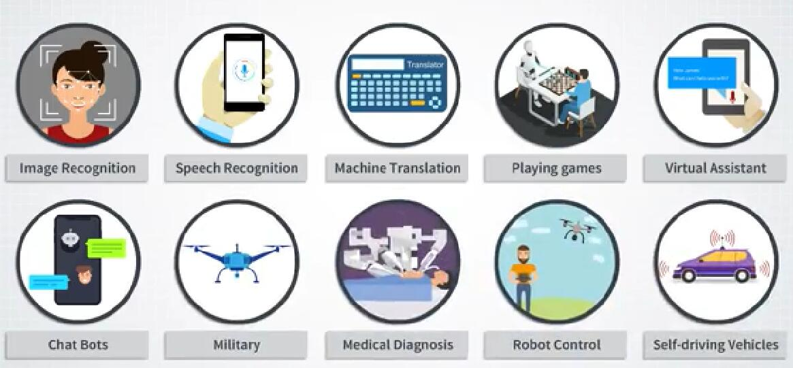

现在，让我们更详细地考虑，传统统计建模和机器学习之间的区别。尽管在两种方法之间绘制一条硬分隔线并不容易，但我们仍然可以指定一些区分它们的广泛类别。首先，统计模型通常试图用基于因果关系的关系来解释世界。相反，机器学习只是试图模仿作品而不是解释它。

我们经常使用相关性作为因果关系的代替。现代统计方法具有非常具体的世界模型，只需要进行估算。在这种方法中推导出可观察量之间的关系。在机器学习方法中引入了可观察量之间的不同关系。这是因为它没有任何先验预先指定的世界模型，而是专注于预测能力。

此外，统计模型通常处理小数据，通常具有多达数百个属性和数千个示例。另一方面，机器学习有时会处理可能具有数十万个属性的数据。由于这种差异，例子数量是数以亿计。虽然可扩展性通常不是统计模型和方法的主要关注点。它有时在机器学习应用中变得至关重要。

最后，我想提一下，虽然统计建模是基于概率方法。一些机器学习方法包括支持向量机，神经网络和一些聚类方法是非概率性的。

现在，是时候介绍机器学习的主要图表了。

回想一下前一个显示智能体和环境的视频的图表。

现在让我用名称 ML 算法替换名称智能体，并再次将它们绘制到元素。 1997 年米切尔的书中给出了机器学习作为学习过程的简明操作定义。它说计算机程序旨在从经验 E 中学习，涉及任务 T 的子类和表现度量 P，如果它在任务 T 中，由 P 测量的表现随经验 E 而改善。

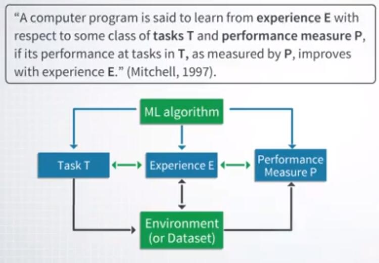

因此，将这三个元素添加到图表中，我们现在可以将其视为机器学习过程的一般描述。但是这个 T，E 和 P 如何？

我们需要更详细地说明任务 T，表现度量 P 和经验 E 的含义。这就是我们接下来要做的。

## 第二部分

所以回顾一下，我们说下一个目标是定义任务类型 'T'，表现度量 'P'，和经验 'E'。让我们从机器学习中遇到的不同类型的任务开始。

请记住我们用于可视化智能体与其环境之间的交互的图表。

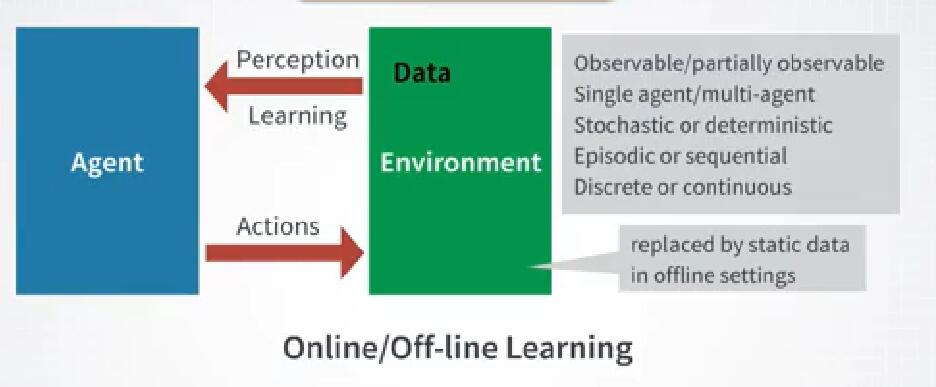

它们可以是许多类型的环境，例如，可观察的或部分可观察的，随机的或确定性的等等。

智能体还可以以不同模式与环境交互。

例如，智能体可以通过传感器实时地与物理环境交互。

这种类型的学习称为在线学习。

当智能体不能对环境实时访问时，会创建不同的设置，但只能访问作为数据存储在计算机磁盘上的快照。

这称为离线或批量学习。

该图表明，有两种常见类型的机器学习任务。

第一种类型由所谓的感知任务组成。

对于这些任务，智能体应从其环境中学习，来执行一个特定的预定义操作。

例如，你可能有一个分类智能体，将所有图像分类为热狗而不是热狗。

因为在这种情况下，智能体的动作是智能体所学习的环境的固定函数，所以我们将这些任务称为感知任务（预测）。

另一类由任务构成，其中智能体应从一组所有可能的动作中选择最佳动作。

让我们称这样的任务为行为任务（决策）。

与感知任务类似，它们涉及从环境中学习的子任务，但最终目标是在许多动作中找到最佳动作。

因此，行为任务通常比感知任务更复杂。

现在，我们来谈谈表现度量 'P'。通常，正确的度量指标的选择特定于任务 'T'。例如，让我们考虑二分类的任务，例如上面的热狗和不是热狗分类器的例子。

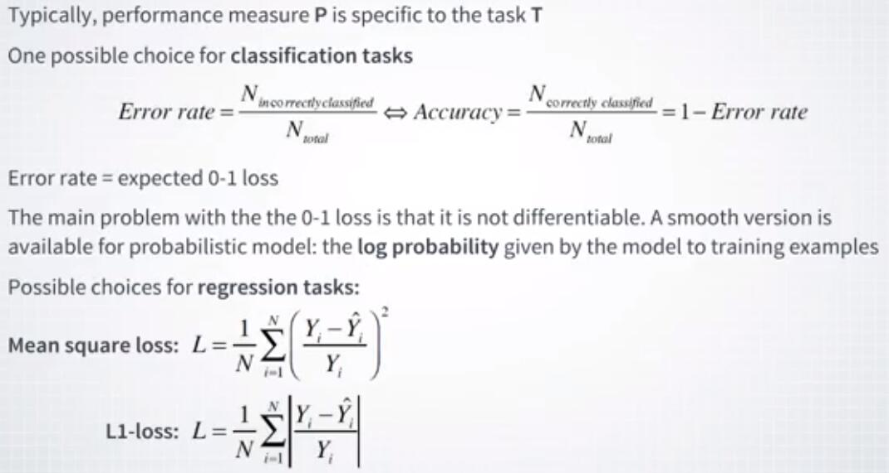

模型精度的一个度量可以是误差率，定义为错误分类的示例与示例总数的比率。

在这种情况下，准确率只是一减去错误率。

错误率也可以被视为预期 0-1 损失率的估计。

这为每个误分类示例给出误差一，每个正确分类示例给出误差零，但是这种表现度量在实践中是不方便的，因为当模型的参数连续变化时它可能会连续地改变。

换句话说，这种表现度量将是其参数的不可微分函数，因此基于梯度的优化方法不能应用于该设定中。

表现度量的错误率的平滑且可微分的替代方案，是在模型的假设下考虑观察数据的概率或低概率。

这产生了可微的目标函数，用于将所有参数拟合到数据的过程，这可以使用基于梯度的优化软件有效地完成。

如果我们处理回归问题，一个特定的表现指标是由此函数定义的均方损失。

这里，Y 是真实观察到的输出，'Y' 帽子是这些输出的模型估计。

总和在所有观察值上计算，因此只有当所有数据点完全匹配模型而没有任何错误时，均方误差才为零。

此处显示的所谓 L-1 损失表示回归的另一个表现指标。

它所做的就是用绝对值替换它们的平方。

根据回归问题的具体细节，它可以是前一个或后一个选项，在每个给定的情况下最合适。

最后，让我们更仔细地看一下经验 'E'的定义。通常，我们可以区分三种主要的学习类型和经验。

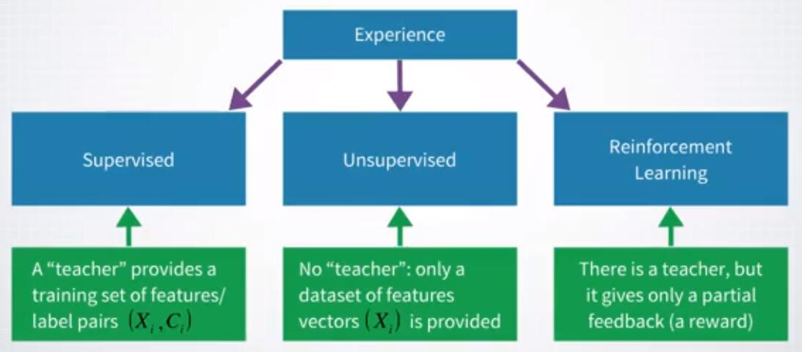

第一种称为监督学习。

它被称为监督学习的原因是，因为这个设定假设为了训练机器学习算法，人类教师给出了一组例子，教师在训练完成后期望从算法中得到什么。

集合由一对属性和右侧标签组成。

你知道它分别为 X 和 C。

这意味着对于具有属性 X 的每个数据点，机器学习智能体可以比较其自己的基于模型的标签 C hat 与该数据点的真实标签 C。

另一种类型称为无监督学习。

它被称为无监督的原因是，这里仅给出了具有属性 X 的示例，但没有教师提供类标签。

在这种情况下，智能体必须提供自己的标签 C 帽，而不依赖于教师提供的标签 C。

最后，第三种经验学习被称为强化学习。

这种情况在前两种情况之间。

有一位教师，但这位教师只对机器学习智能体的表现给出了部分反馈。

反馈来自智能体在执行其操作时收到的奖励。

智能体已知的，最大化某些目标的行为，会得到更高的奖励，而其他行为变得更小甚至是负面奖励，即他们受到惩罚。

将机器学习算法分类为监督，无监督和强化学习可能是机器学习最基本的本体论。

绝大多数适合机器学习技术的实用算法都属于这些类别之一。

在下一个视频中，我们将深入研究此类别中更具体的机器学习任务。

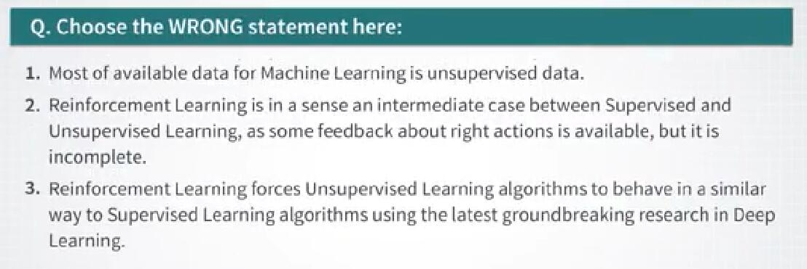

## 第三部分

好的，所以上周在这里，我们介绍了金融机器学习的三个主要过程。即监督学习，无监督学习和强化学习。现在我们可以进一步开发这个选集，让我们再看一下图表。

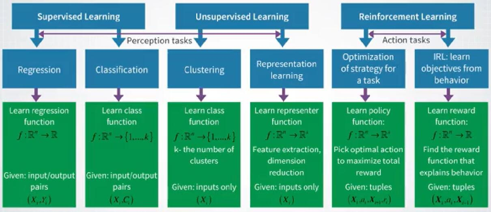

我想在这里添加的第一件事是，监督和无监督学习都是关于感知任务。这是因为在这二者中，智能体应该执行一个特定的操作，例如，对图像进行分类。另一方面，强化学习就是行动任务。所以我们将其添加到图表中。现在让我们从监督学习开始，可以考虑这个课程中的更具体的任务。第一项任务，也是最常见的金融任务，就是回归。对于这些任务，目标是学习实值函数，它将 n 维空间 Rn 映射到实值直线 R 上。教师提供输入输出对，x 和 ys 的训练集，其中 y 是实数，x 是 Rn 中的向量。另一个非常常见的监督学习任务是分类。此处的设定与回归完全相同，但此时，ys 是离散数字。你现在看到类别标签。而不是像回归那样连续的东西。

现在让我们考虑无监督学习。正如我们之前所说，在这种情况下，没有教师提供正确的答案。但是，我们可以为智能体提供任何有意义的任务吗？嗯，一个这样的任务可以是聚类，也称为商业细分。然而，要将数据点的集合聚类或划分为同构的点分组，你只需要提供所有点的算法属性 x。就函数而言，它看起来与分类完全相同，只是没有向算法提供类标签。另一大类无监督学习算法称为表示学习。该术语包括大量不同的方法，其主要思想始终相同。具体地说，该任务是将初始 n 维数据，其中 n 可以是大数字，映射为 k 维的较低维度空间，其中 k 较小且通常远小于 n。这些任务也称为降维或未来教学任务。

我们稍后将在此可视化中看到，表示学习任务在金融中非常常见。它们作为监督学习问题的一部分出现，或者直接在特定的商业环境中使用。例如，一家创意汽车公司可能会针对不同的广大汽车用户群采用不同的营销策略。最后，让我们看看强化的例子。

在 enforcement lowering 中优化的函数，是这种所谓的策略函数。这个函数规定了智能体应该根据环境的当前状态做什么，以便在一段时间内最大化其总价值，我们将在本专项的最后一个课程中更详细地讨论。为了实现如此低的等级，训练数据应该采用元组的形式，其中包含当前状态动作、下一个状态的东西、这样做的奖励。除了这种直接强化学习之外，人们对替代形式也有不同的兴趣，称为逆强化学习。在此设置中，所有内容都与直接强化学习相同，但是没有智能体在采取行动时收到的奖励的信息。相反，我们只是给出了一系列环境状态和智能体的行动。并假设，我们被问到，智能体在作出这些行为时所追求的目标。另一个问题是，智能体的最佳可能行动策略是什么，甚至可能与用于收集数据的策略不对应。这就是景观的高级描述。

现在，我们的图表为你提供了完整的高级机器学习类型。机器学习中也有一些中间类别，如半监督学习或主动学习。

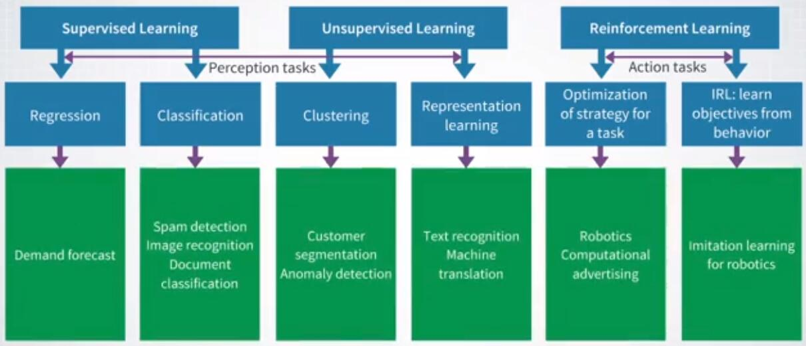

但我们不会在这个专项中处理这些主题。我们可以稍微修改一下这个图表。这样我们就可以直观地展示技术行业中机器学习的最常见应用。像谷歌，Facebook，亚马逊等公司。从回归开始，最常见的使用技术包括销售预测，事件预测和类似任务。对于分类，典型的工业应用是垃圾邮件检测，图像识别或文档分类。聚类方法用于客户细分或异常检测。表示学习方法尤其用于文本识别和机器翻译。最后，直接强化学习广泛用于机器人和计算广告。那么，大部分已发表的学习工作都涉及机器人技术。提供用于不同类型的机器学习的特定方法的简要概述，可能也是有用的。

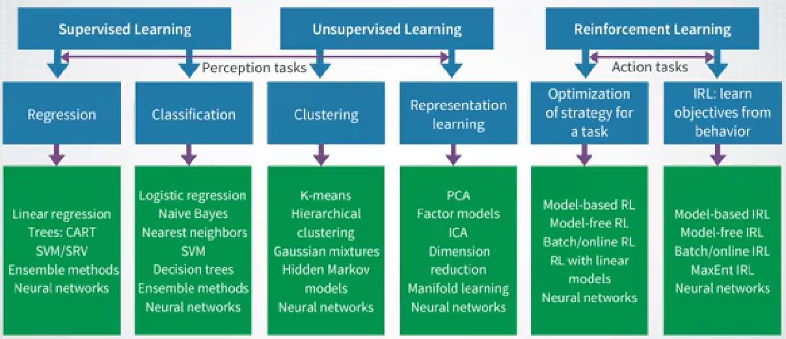

这可以通过该图表表示。如果你不熟悉绿色矩形中的部分或全部术语，请不要担心。我将在本专项的后面介绍大部分这些方法。所以这个图表主要是为了你未来的努力。但我想在这里提出的观点是，你可以注意到，神经网络存在于所有类型的机器学习中。因此，它们提供了适用于所有类型机器学习的多功能和通用的方法。神经网络的意义在于，它们可以使用统称为深度学习的方法扩展到非常大的数据集。

2007 年左右出现了深度学习，作为一种使用大型神经网络的新方法。从那以后，它产生的算法大大超过了其他机器学习算法，用于图像识别和机器翻译等任务，以及许多基础和工业应用。因为它们是非常普遍和强大，我们将花费大量时间在神经网络的便利和影响中，来解决金融问题。

但首先，我想谈谈机器学习的一般金融问题。我们在下一个视频中进行操作。

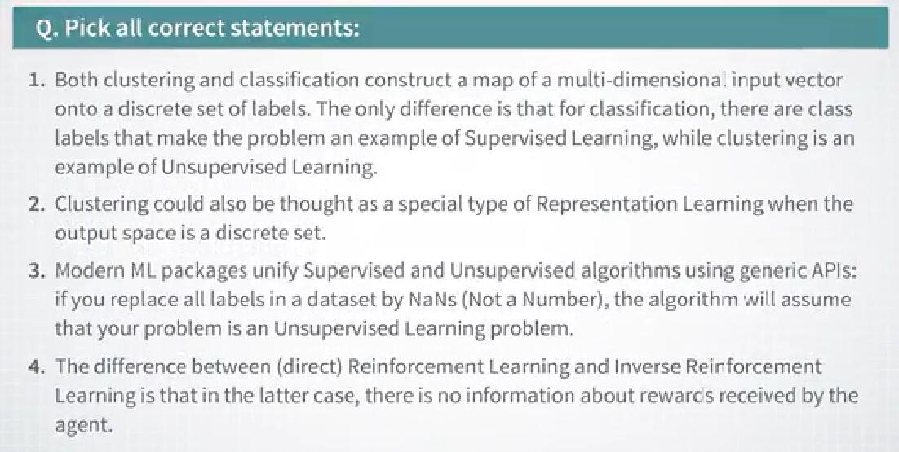

