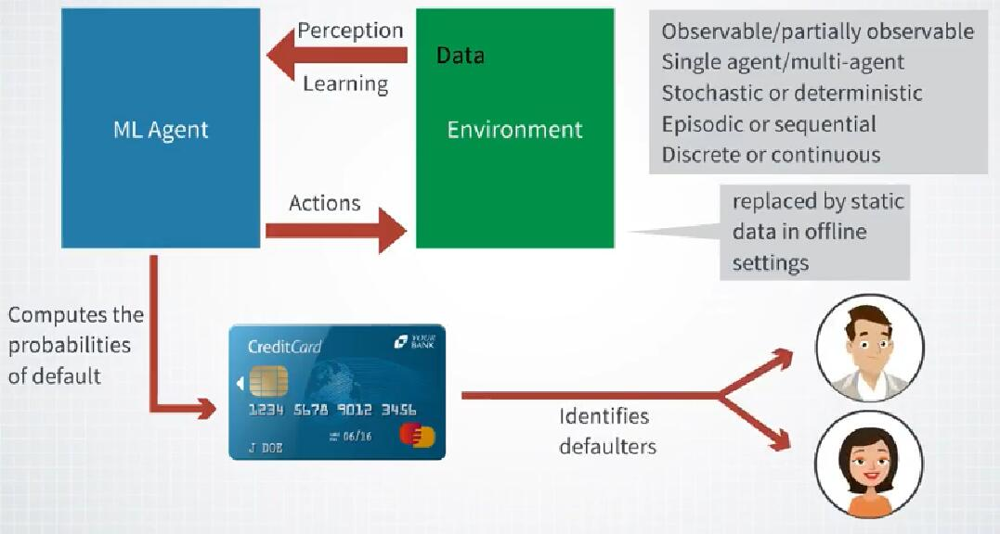
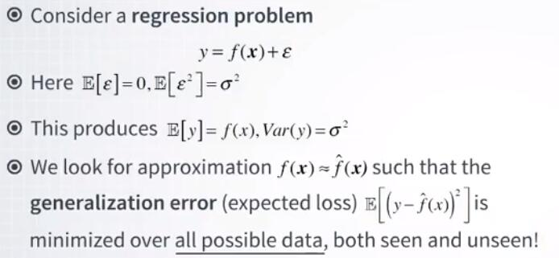
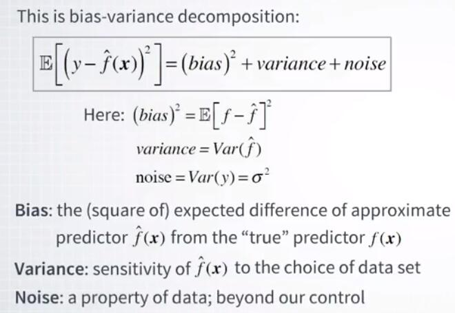
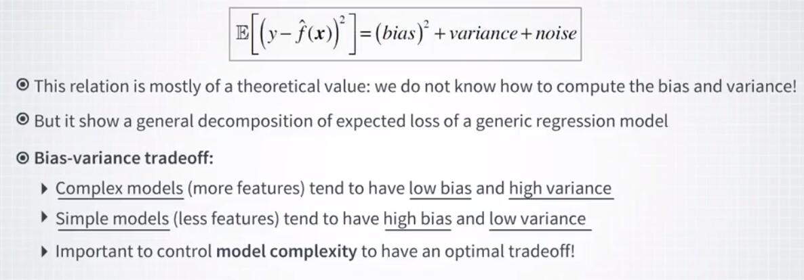

# 1.2.1 泛化和偏方差权衡

好的，到目前为止，我们讨论了机器学习和人工智能之间的关系，机器学习方法的广阔前景。金融机器学习与技术机器学习之间存在差异。现在是时候进一步深入详细地了解机器学习如何工作。让我们从机器学习最重要的目标开始，即泛化的目标。

让我们回到一个图表，该图表显示了我们在上一个讲座中介绍的智能体的学习过程。在这里，我们左侧有一个机器学习智能体，它与右侧的环境进行交互。智能体会感知并了解其环境，以便更好地执行其行动来实现其目标。例如，你的智能体可能是一种算法，用于计算给定客户在信用卡上的违约概率。然后，目标是对许多持卡人计算平均时，使预测尽可能准确。这是通过学习的转变。该算法从可用数据中学习有用信息，以便在新的看不见的数据上表现良好。这种在新数据上表现良好的能力称为泛化。而这种能力是在机器学习环境中学习的最终目标。现在让我们尝试量化泛化能力的概念。

让我们考虑一个经典的回归问题，其中我们有一个预测器的向量，或者特征，x，以及尺度 y，我们认为这是由这些预测器驱动的。例如，y 可以是特定股票的回报。 x 可以是市场指数的向量，如标准普尔 500 指数，道琼斯工业平均指数，纳斯达克综合指数，市场情绪指数等。我们想找到一个函数`y = f(x) + epsilon`，它将在给定 x 的值的情况下预测 y 的值。

这里 epsilon 是一个随机误差项，均值为 0 和方差为 sigma 平方。我们希望找到函数`f(x)`的近似值，它可以很好地泛化。这是什么意思？这意味着，这种近似应该最小化所有数据的平方损失函数，`y-f(x)`的平方，无论是看到的还是看不见的。

因此，这种最小化问题是这个表达式，平方损失函数的期望展示在这里。这里的符号`e`意味着我们对所有可能的组合计算期望，即`f(x)`和 epsilon，这可能在我们新的，尚未见到的数据中遇到。

因此，一旦我们定义了一个目标函数，让我们看看如果我们试图最小化它会发生什么。首先，我们求解平方并用期望值之和代替总和的期望值。

其次，我们将平方的期望表达为方差和期望的平方。并使用原始方程来求解最后一项。接下来，我们组合所有项来获得最终公式。

现在我们得到了一个特殊的名字，它被称为偏差 - 方差分解。这是先前公式的拆开表述，让我们再读一遍。它表示回归问题的泛化误差等于偏差平方，方差和噪声之和。让我们一个接一个地讨论这些术语。偏差平方是近似预测器和真实预测器之间预期差异的平方。方差衡量估计器对数据选择的敏感性。

请注意，这只是 f 帽子而不是 f 的函数。最后，噪声项根本不依赖于 f 或 f 帽子。这是我们无法控制的数据属性。

现在，重要的是要注意，偏方差分解主要是理论值。实际上，我们不知道真实预测器 f(x)，我们不知道如何计算偏差和方差项中出现的期望值。但是，它显示了两种不同的模式，通过这两种模式，模型的泛化误差可能会恶化。你的模型可能有很大的偏差，或者它可能有很大的方差。

此外，在大多数实际情况中，机器学习算法的一般趋势是，偏差和方差之间具有一种强烈的负相关性。这称为偏差 - 方差权衡。为了减少偏差，你可能愿意考虑包含更多特征的更复杂的模型。这些倾向于减少偏差，因为你的模型更灵活，它有更多的容量来适应数据。

然而，另一方面，添加更多特征通常会增加方差。反之亦然，你可以使用简单的线性模型进行回归，但特征数量较少。那么你的模型将具有较小的方差，但它会有很大的偏差。

因此，为你的问题构建正确的模型，需要找到与数据复杂性相匹配的，正确级别的模型复杂性。

但也许可以事先通过数据的某些特征来建立正确级别的模型复杂性和模型架构。例如，它的维度而不是数据本身。想象一下，例如，如果我们可以有简单的规则，生活将是多么简单，如果数据的维度低于 100，则使用随机森林算法进行分类。如果大于它，则使用神经网络。

在下一个视频中，我们将检查这些想法是否可行。

