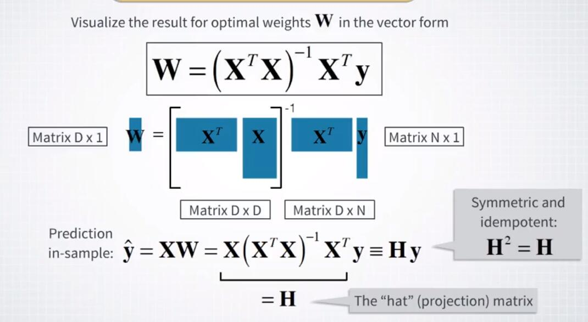
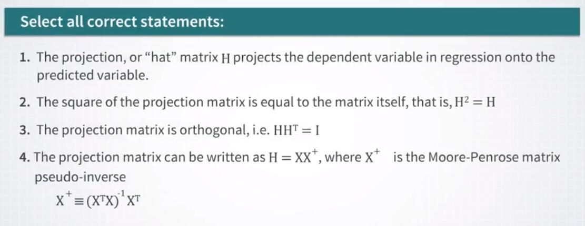

# 1.2.4 线性回归

现在是时候介绍我们的第一个机器学习算法了。

而出人意料，这个算法是着名的线性回归，这是一种你可能熟悉的算法。我们将通过将其视为典型的机器学习算法，来了解线性回归的原理，算法具有我们之前介绍的任务，表现测量和机器学习方法的其他属性。

为了稍微调整一下，我们将从一开始就考虑一般的多变量情况。

首先，让我们从任务 T 开始。我们的任务是预测标量变量 y 的值，给定预测器或特征向量 X0 到 XD-1，这将是 D 维空间 RD 中的向量。

现在，为了从经验中学习，我们给出了一对 X 和 y 的数据集，我们可以像以前一样分成两个数据集，X_train，y_train 和 X_test，y_test。假设这两个数据集都是来自某些数据生成分布 P 数据的 IAD 样本。接下来，考虑我们想要使用的模型架构。由此，我们的意思是定义一个 X 函数空间，我们试图拿它拟合我们数据。

在这种情况下，我们选择线性架构。也就是说，我们将自己约束为 X 的一类线性函数。这里，y 是 N 个预测值的向量。X 是尺寸为 N×D 的设计矩阵。W 是长度为 D 的回归系数的向量。

这种向量通常也被称为机器学习中的权重向量。

现在，这种线性回归模型的一个例子是，试图预测某些股票的每日回报的模型。让我们例举亚马逊股票。虽然 X 将是各种市场指数回报的向量，例如标准普尔 500 指数，纳斯达克综合指数，VIX 等。现在我们必须指定表现指标。我们将其定义为，在测试集上计算的均方误差或简称 MSE。因此，为了计算它，我们计算测试集中 O 个点的不同 Y，和模型预测 Y hat 之间的平方差的平均值。同样的事情也可以更紧凑地写成，因为向量 Y hat 和 Y 之间的重缩放的平方距离。

现在我们可以用上面的模型方程代替 Y hat，并用这种形式写出来。

接下来的问题是如何找到最佳参数 W。

我们按照在上一讲中讨论的那样继续进行，并寻找最小化另一个目标的参数 W，即训练集上的 MSE 误差。这将是与此处相同的等式，但 X_test 由 X_train 代替，Y_test 由 Y_train 代替。

原因是两个均方误差以及训练和测试数据都估计相同的数量，这是泛化误差。

现在，为了找到 W 的最佳值，我们需要将 MSE 训练误差的梯度设置为 0。这给出了这个表达式，对于 W 的最佳向量，它应该等于 0。现在，让我们在 N_train 上添加一个不必要的常数乘数 1，并将梯度写为向量范数的梯度，我们将其写为向量和自身的标量积。

这里，符号 T 代表转置向量。

现在，让我稍微简化一下这个关系，省略上标，因为我们不需要它们。我们只记得在这个计算中我们只使用训练数据。

现在，下一步，我们扩展标量乘积并计算相对于 W 的整个表达式的导数。

由于第一项是 W 的二次方，第二项几乎是线性的，而最后一项完全不依赖于 W，它会在微分时省略。结果，我们得到了这个表达式。对于最佳向量 W，它应该等于 0。现在通过简单地对等式求逆来获得 W 最佳值。所以我们最终得到了这个公式。

这种关系也称为回归分析中的正规方程。让我们回想一下，这里的 X 和 y 指的是训练集中的值。

为了了解此处涉及的矩阵运算，如此处所示，可视化此关系也很有用。

现在，给定估计向量 W，我们可以用它做一些事情。首先，我们可以通过将 X_train 左乘 W 来计算训练或样本内误差。

如果我们用这个表达式代替 W，我们看到它可以表示为矩阵 H 的乘积，由数据矩阵 X_train 和向量 y_train 组成。该矩阵有时称为 H hat 矩阵。你可以检查此矩阵是否为投影矩阵。

特别是，它是对称的和幂等的，意味着它的平方等于矩阵本身。

估计向量 W 的另一个方面是使用它来进行预测。

例如，如果我们使用测试数据集来预测样本，那么答案就是 X_test 和向量 W 的乘积。

现在，请注意这种关系中有趣的事情。我们看到 W 的表达式包括 X 转置和 X 矩阵的乘积的倒数。如果数据矩阵 X 包含几乎相同或非常强相关的列，则可能导致该乘积几乎是退化矩阵的情况。

当一列可以表示为其他列的线性组合时，会发生另一种常见情况，产生几乎退化矩阵。这在统计学上被称为多重共线性现象。这是该矩阵的行列式。在所有这些情况下，我们在数字上非常接近于零。这可能导致预测值不稳定或无穷大。

有多种方法可以防止线性回归中的这种不稳定性。其中之一是扫描预测变量集以排除可能的多重共线性。但也有一些其他方法。特别是，在下一个视频中，我们将讨论平等化，是一种在监督学习算法中提供更好的样本外性能的方法。

