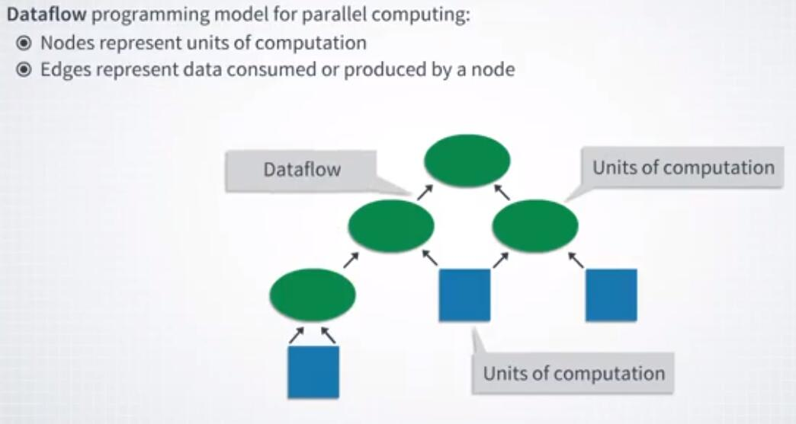
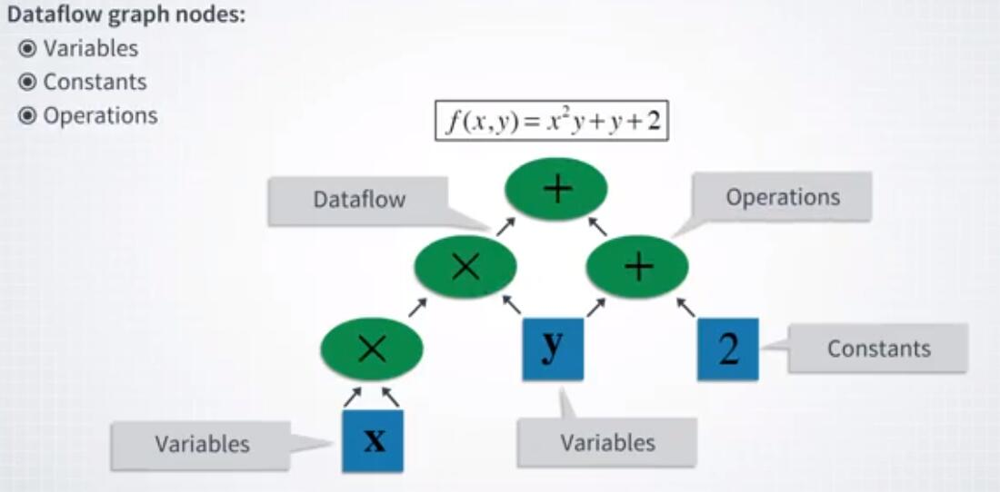
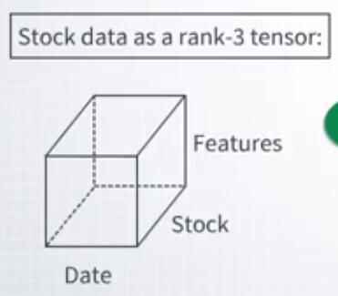
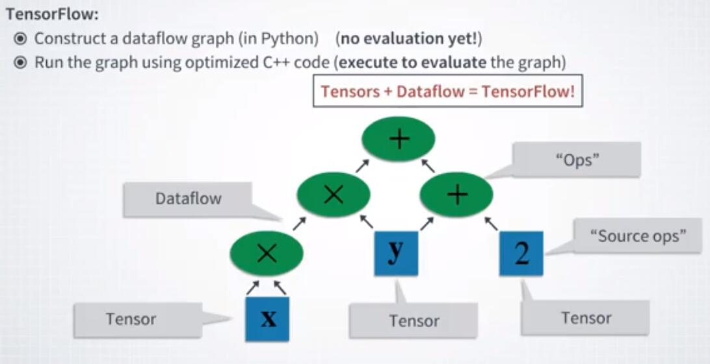
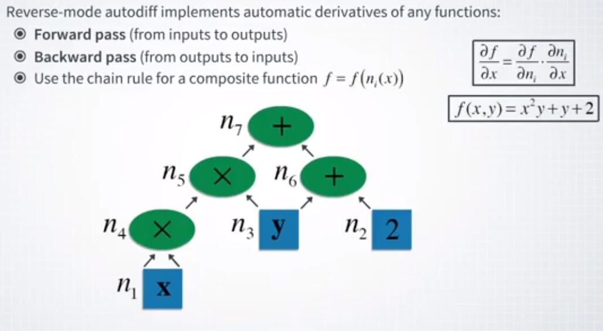
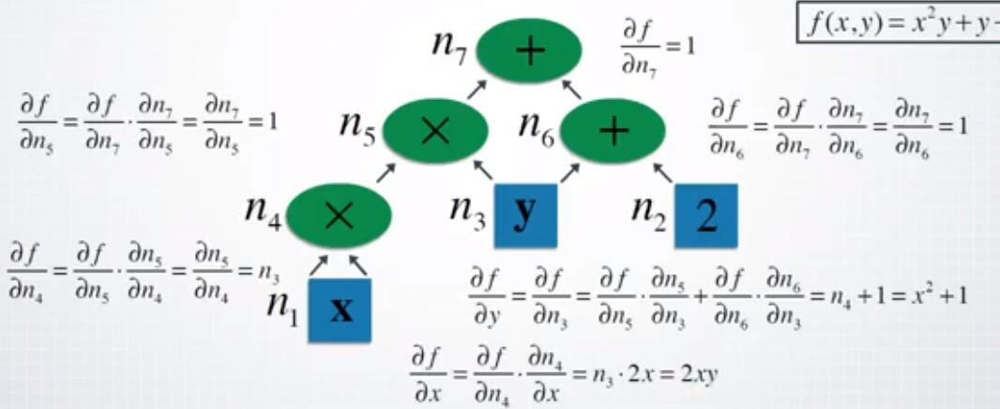
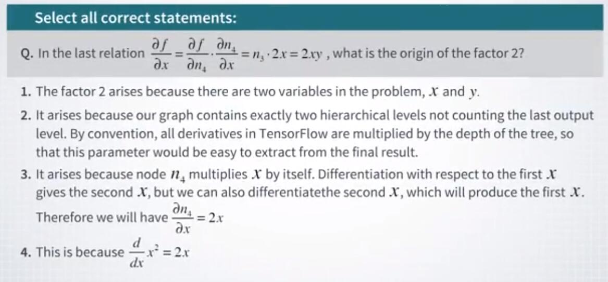

# 1.2.7 数据流和 TensorFlow

好的，让我们从 TensorFlow 开始，它，以及其他一些库，将是我们本课程中的主要工具之一。

什么是 TensorFlow？ TensorFlow 是一个高质量的，可用于生产和资源友好的机器学习库。

在 2015 年 11 月由谷歌开源之后，它迅速成为最受欢迎的框架之一，无论是在机器学习研究人员社区还是从业者之间。

作为一个例子，我只能提到谷歌在其业务中使用的大多数相关任务，现在由 TensorFlow 提供支持。

很快，这可能会让你了解一旦掌握了这个伟大的工具，你可以获得什么样的力量。

正如你将看到的，稍后，TensorFlow 不仅是机器学习的一个很好的工具，而且由于其灵活性，计算和分析能力，对一般的应用数学也非常有用。

让我们从 TensorFlow 的组织方式入手。

TensorFlow 中实现的主要思想是数据流计算模型。

这个想法虽然听起来很简单，但对于实际的机器学习算法的优先级，可扩展性和可移植性来说，这一点至关重要。

让我们看看它是如何工作的。

数据流图是具有节点和边的图，节点表示某些计算单位，边表示由任何给定节点消耗或产生的数据。

换句话说，边表示图上的数据流。

这就是为什么它被称为数据流图。

让我们看看我们如何表达两个变量 x 和 y 的简单函数，这里显示 x 平方乘 y + y + 2。

为此，我们首先介绍几种节点。

首先，我们将有蓝色方块。

这些代表函数输入。

它们可以是变量，如 x，y，或者它们可以是常量，如用于固定数的节点，在此函数中为 2。

像这些椭圆形的其他节点代表操作，或简称 ops。

这些在输入和其他操作的输出上执行。

现在让我们使用这个数据流图再进一步，看看如果我们向图输入其他张量，而不是常规数字，会发生什么。

但什么是张量？如果你熟悉 Numpy 中的多维数组，那么它们就是这些张量。

换句话说，张量是多维数学对象，可以用 Python 或其他语言存储为多维数组。

如果你从未使用 Python 中的多维数组，但只熟悉矩阵或二维数组，你可以考虑这样的矩阵列表。

这将是 3 阶张量。

为什么它是 3 阶的，什么是张量的阶？张量的阶只是张量的维数。

对于我们的例子，这个数字将是 3，因为我们将有三个坐标来存储我们的矩阵列表。

矩阵的数量，行和列。

在金融中使用 3 阶张量的一个非常自然的例子是股票数据。

在这样的张量中，一个维度代表日期，另一个代表股票代码，第三个维度代表你希望包含在分析中的该主题的所有特征。

例如，如果你使用一组日期获取一组股票的股票数据，它将返回一个称为数据面板的对象，该对象实现了这种类型的张量。

请注意，无论你希望在此分析中包含多少东西，你的数据仍将是 3 阶张量。它仅仅沿着第三维度增加元素数量。因此，一旦我们让张量存在于数据流图上，我们就理解了 TensorFlow。它的名字是它的作用的准确描述。

它在图上计算称为 Tensor 的数据流。更确切地说，它分两步进行。首先，它允许你使用高级 Python API 为你的问题构建数据流图。然后，它允许你在单个设备（如 CPU 或 GPU），或此类设备的网络上执行此图。正如我之前提到的，TensorFlow 于 2015 年由谷歌开源。从那时起，它成为最受欢迎的机器学习工具之一。我们将在本周末，通过可视化，看到为什么会出现这种情况。

现在，让我们回到 TensorFlow 的主要架构思想。正如我们刚才所说，第一个是数据流图的概念。另一个是延迟求值的想法。什么是延迟求值？延迟求值正是将你的计算分为我刚刚提到的两个步骤。你只需第一步来构建图。

你可以将其视为详细的项目规范，你可以将其提供给助理，详细说明项目中应该执行的操作和顺序。当你将图传递给 CPU 或 GPU 等设备时，实际计算将在第二步进行。该设备会将你的图转换为高度优化的 C++ 代码并进行计算。你还可以在图上创建一些节点。等待其他一些节点在开始之前执行，而不是整个图。虽然延迟求值对于 TensorFlow 的高效工作非常重要，但作为用户，了解 TensorFlow 的另一个关键特性，即自动微分更为重要。

更具体地说，TensorFlow 实现了一种特定的算法，用于对参数自动微分具有许多输入的任何函数。该算法称为反向模式自动微分，以下是它的工作原理。它首先执行从输入到输出的正向传播，来评估给定输入的函数。它在图上执行反向传播，从输出到输入。

这允许它按顺序计算所有导数。在这种顺序计算中使用的技术，只是复合函数的导数的链式规则。为了回顾链式规则，它表示如下。如果函数 f 的参数是独立参数 x 的另一个函数 n ，则函数 f 对 x 的导数，由 f 对 n 导数与 n 对 x 的乘积给出。现在让我们使用前面的例子看看它是如何工作的。

让我们首先为图表上的节点分配数字。所以我们将有节点 1,2,3 等。让我们从最后一个节点 n7 开始。因为这个节点的输出是我们函数本身的值，所以我们将编写函数对于节点值的导数，在这种情况下将是 1。

现在，让我们转到节点 6。我们使用链式规则计算输出对该节点的导数。我们在这里有两个导数的乘积，但是第一个导数已经知道并且它等于 1。因此输出对节点 6 的导数将由该导数给出，该导数再次为 1，因为节点 n7 实现了一个加法迭代。接下来，我们计算关于节点 n5 和 n4 的导数。

请注意，在第二个表达式中，我们最终得到节点 n5 对 节点 n4 的导数。因为节点 n5 是节点 n4 乘以 n3 ，所以导数等于节点 n3 的值。

现在我们计算相对于节点 n3 的导数，节点 n3 携带输入 y。在这种情况下，我们必须记住节点 n3 连接到图上的两个节点 n5 和 n6。因此，我们通常中使用两项来计算导数。这个导数的最终答案是 x 平方 + 1，这肯定是一个正确的答案，因为我们可以通过我们的函数 f 的微分来检查它。最后我们计算 x 的导数。同样，这里的数字 2xy 正是我们通过函数 f 对 x 的微分得到的。所以这是我们对 TensorFlow 的第一次理论介绍。

总结一下，TensorFlow 提供了极大的灵活性和整洁的设计结构，来构建机器学习模型。它具有非常强大的功能，可以自动计算任意函数的导数。它还有许多其他强大的功能，例如可视化工具，当我们开始使用 TensorFlow 时，你将看到它们。这正是我们接下来要做的事情。在下一个视频中，我们将运行我们的第一个标准流程代码，在非常简单的算术示例中，来查看图的工作原理。

